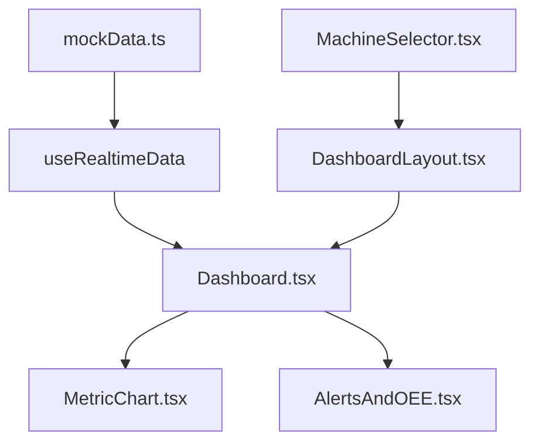

# 🏭 Dashboard de Automação Industrial

> Sistema de monitoramento em tempo real para linha de produção industrial com múltiplas máquinas, alertas inteligentes e métricas de eficiência (OEE).

## 📋 Índice

- [Visão Geral](#-visão-geral)
- [Funcionalidades](#-funcionalidades)
- [Tecnologias](#-tecnologias)
- [Estrutura do Projeto](#-estrutura-do-projeto)
- [Instalação](#-instalação)
- [Como Executar](#-como-executar)
- [Testes](#-testes)
- [Storybook](#-storybook)
- [Arquitetura](#-arquitetura)
- [Componentes Principais](#-componentes-principais)
- [Decisões Técnicas](#-decisões-técnicas)
- [Funcionalidades Avançadas](#-funcionalidades-avançadas)
- [Screenshots](#-screenshots)
- [Autor](#-autor)

## 🎯 Visão Geral

Dashboard desenvolvido para monitoramento industrial em tempo real, focado em **10 tipos diferentes de máquinas** (misturadores, prensas, fornos, compressores, etc.) com sistema completo de alertas, métricas de eficiência e interface responsiva.

### ✨ Destaques

- 📊 **Monitoramento em tempo real** de 10 máquinas industriais diferentes
- 🚨 **Sistema de alertas** com 3 níveis de severidade (INFO, WARNING, CRITICAL)
- 📈 **Métricas OEE** (Overall Equipment Effectiveness) completas
- 🎨 **Interface responsiva** com modo dark/light
- ⚡ **Performance otimizada** com React.memo, useMemo e debounce
- ♿ **Acessibilidade completa** (ARIA, navegação por teclado, screen readers)
- 🧪 **Testes E2E** com Playwright (6 cenários de teste)
- 📚 **Storybook** para documentação interativa de componentes

## 🚀 Funcionalidades

### Funcionalidades Obrigatórias ✅

- [x] **Monitoramento em Tempo Real**

  - Estados: RUNNING, STOPPED, MAINTENANCE, ERROR
  - Métricas: Temperatura, RPM, Tempo de Operação, Eficiência
  - Atualização a cada 3 segundos
  - Tratamento de desconexão

- [x] **Visualização de Dados**

  - Cards de métricas com indicadores de tendência (▲▼)
  - Gráfico histórico (Recharts) com últimos 30 pontos
  - Interface responsiva (desktop, tablet, mobile)
  - Medidores visuais coloridos

- [x] **Sistema de Alertas**

  - 3 níveis: INFO (🔵), WARNING (🟡), CRITICAL (🔴)
  - Histórico ordenado por prioridade e timestamp
  - Feedback visual com cores e ícones
  - 10 alertas realistas pré-configurados

- [x] **Métricas de Eficiência Industrial**
  - OEE (Overall Equipment Effectiveness)
  - Disponibilidade, Performance, Qualidade
  - Indicadores visuais de performance
  - Barra de progresso colorida

### Funcionalidades Extras 🎁

- [x] **Modo Dark/Light** funcional
- [x] **Histórico persistente** (LocalStorage)
- [x] **Testes E2E** completos (Playwright)
- [x] **Storybook** para documentação de componentes
- [x] **Otimizações de performance** avançadas
- [x] **Acessibilidade completa** (WCAG 2.1)
- [x] **10 máquinas diferentes** com métricas específicas
- [x] **Seletor de máquinas** via modal de configurações
- [x] **Visão geral** de todas as máquinas

## 🛠 Tecnologias

### Stack Principal

- **React 18.3** - Framework frontend
- **TypeScript 5.6** - Tipagem estática
- **Vite 6.0** - Build tool e dev server
- **Tailwind CSS 3.4** - Estilização utilitária

### Bibliotecas Específicas

- **Recharts 2.12** - Gráficos responsivos
- **Lucide React 0.453** - Ícones modernos
- **React Router 7.0** - Roteamento SPA

### Ferramentas de Desenvolvimento

- **Playwright 1.49** - Testes E2E
- **Storybook 8.0** - Documentação de componentes
- **ESLint 9.15** - Linting de código
- **PostCSS 8.5** - Processamento CSS
- **TypeScript ESLint 8.18** - Linting TypeScript

## 📁 Estrutura do Projeto

```
industrial-dashboard/
├── 📁 src/
│   ├── 📁 assets/          # Imagens e recursos estáticos
│   │   └── logo.png
│   ├── 📁 components/      # Componentes reutilizáveis
│   │   ├── ThemeToggle.tsx         # Alternador dark/light
│   │   ├── MetricChart.tsx         # Gráfico otimizado (Recharts)
│   │   ├── AlertsAndOEE.tsx        # Alertas e métricas OEE
│   │   ├── MachineSelector.tsx     # Seletor de máquinas
│   │   └── AccessibilityProvider.tsx # Contexto de acessibilidade
│   ├── 📁 context/         # Contextos React
│   │   └── ThemeContext.tsx        # Gerenciamento de tema
│   ├── 📁 hooks/           # Hooks customizados
│   │   ├── useRealtimeData.ts      # Hook otimizado para dados em tempo real
│   ├── 📁 layouts/         # Layouts da aplicação
│   │   └── DashboardLayout.tsx     # Layout principal com header
│   ├── 📁 pages/           # Páginas da aplicação
│   │   ├── Dashboard.tsx           # Dashboard principal
│   │   └── NotFound.tsx            # Página 404
│   ├── 📁 services/        # Camada de dados
│   │   └── mockData.ts             # 10 máquinas + 10 alertas realistas
│   ├── 📁 stories/         # Stories do Storybook
│   │   ├── Button.stories.ts       # Stories dos componentes
│   │   ├── MetricChart.stories.ts  # Stories do gráfico
│   │   └── AlertsAndOEE.stories.ts # Stories de alertas e OEE
│   ├── 📁 types/           # Definições TypeScript
│   │   ├── MachineStatus.ts        # Interface das máquinas
│   │   ├── Alert.ts               # Interface dos alertas
│   │   └── MetricHistory.ts       # Interface do histórico
│   ├── 📁 utils/           # Utilitários
│   ├── App.tsx             # Componente raiz
│   ├── main.tsx            # Entry point
│   └── index.css           # Estilos globais + Tailwind
├── 📁 tests/               # Testes E2E
│   └── 📁 e2e/
│       └── dashboard.spec.ts       # 6 cenários de teste
├── 📁 public/              # Arquivos públicos
├── 📄 .storybook/          # Configuração do Storybook
│   ├── main.ts             # Configuração principal
│   └── preview.ts          # Configuração de preview
├── 📄 package.json         # Dependências e scripts
├── 📄 playwright.config.ts # Configuração Playwright
├── 📄 tailwind.config.ts   # Configuração Tailwind
├── 📄 tsconfig.json        # Configuração TypeScript
└── 📄 vite.config.ts       # Configuração Vite
```

## 🔧 Instalação

### Pré-requisitos

- **Node.js 18+**
- **npm** ou **yarn**

### Passos

1. **Clone o repositório**

```bash
git clone https://github.com/LucasRafa13/industrial-dashboard
cd industrial-dashboard
```

2. **Instale as dependências**

```bash
npm install
# ou
yarn install
```

## ▶️ Como Executar

### Ambiente de Desenvolvimento

```bash
npm run dev
# ou
yarn dev
```

🌐 Acesse: `http://localhost:5173`

### Build de Produção

```bash
npm run build
npm run preview
```

### Storybook (Documentação de Componentes)

```bash
npm run storybook
# ou
yarn storybook
```

🌐 Acesse: `http://localhost:6006`

### Linting

```bash
npm run lint
```

## 🧪 Testes

### Testes E2E (Playwright)

```bash
# Instalar browsers do Playwright
npx playwright install

# Executar todos os testes
npm run test:e2e
# ou
npx playwright test

# Executar em modo interativo
npx playwright test --ui

# Executar apenas um arquivo
npx playwright test dashboard.spec.ts
```

### Cenários de Teste Implementados

1. ✅ **Renderização dos cards** - Verifica se todos os 4 cards principais estão visíveis
2. ✅ **Gráfico de métricas** - Verifica se o gráfico Recharts está funcionando
3. ✅ **Alertas e OEE** - Verifica se as seções de alertas e métricas estão visíveis
4. ✅ **Atualização de dados** - Verifica se os dados estão sendo atualizados
5. ✅ **Responsividade** - Testa em viewport mobile e desktop
6. ✅ **Formatação de valores** - Verifica formatação de temperatura, RPM e uptime

## 📚 Storybook

O projeto inclui **Storybook** para documentação interativa e desenvolvimento isolado de componentes.

### 🎯 Componentes Documentados

- **🎨 ThemeToggle** - Alternador de tema dark/light
- **📊 MetricChart** - Gráfico de métricas em tempo real
- **🚨 AlertsAndOEE** - Sistema de alertas e métricas OEE
- **🏭 MachineSelector** - Seletor de máquinas industriais
- **📱 Cards de Métricas** - Cards responsivos com indicadores

### ✨ Features do Storybook

- **🎨 Controles interativos** - Modificar props em tempo real
- **📱 Testes de responsividade** - Diferentes viewports
- **🌙 Modo dark/light** - Visualizar componentes em ambos os temas
- **♿ Testes de acessibilidade** - Verificação automática de ARIA
- **📖 Documentação automática** - Props e tipos TypeScript

### 🚀 Como usar o Storybook

```bash
# Iniciar o Storybook
npm run storybook

# Build do Storybook para produção
npm run build-storybook
```

**Funcionalidades disponíveis:**

- 🎛️ **Controls**: Altere props dos componentes dinamicamente
- 📐 **Viewport**: Teste responsividade em diferentes tamanhos
- ♿ **Accessibility**: Verifique conformidade com WCAG
- 📖 **Docs**: Documentação automática com exemplos de código

## 🏗 Arquitetura

### Padrões Utilizados

- **Component Composition** - Composição de componentes reutilizáveis
- **Custom Hooks** - Lógica encapsulada em hooks customizados
- **Context API** - Gerenciamento de estado global (tema)
- **Service Layer** - Camada de dados isolada em `/services`
- **TypeScript Strict** - Tipagem rigorosa em toda aplicação

### Fluxo de Dados



## 🧩 Componentes Principais

### `useRealtimeData` Hook

**Responsabilidade**: Simular dados em tempo real com padrões realísticos

**Features**:

- ⏱️ Atualização a cada 3 segundos
- 🎯 Simulação específica por tipo de máquina (forno, prensa, etc.)
- 💾 Persistência no LocalStorage
- 🔄 Debounce para performance
- 👁️ Pausa quando aba não está visível
- 🌐 Detecção de status online/offline

```typescript
const data = useRealtimeData({
  machineId: 'mix-001',
  updateInterval: 3000,
})
```

### `MetricChart` Component

**Responsabilidade**: Visualização gráfica das métricas históricas

**Features**:

- 📊 Gráfico de linhas com Recharts
- 🎨 3 linhas: Temperatura, RPM, Eficiência
- 📱 Responsivo em todos os dispositivos
- ♿ Totalmente acessível (ARIA labels)
- ⚡ Otimizado com React.memo

### `AlertsAndOEE` Component

**Responsabilidade**: Exibição de alertas e métricas de eficiência

**Features**:

- 🚨 3 níveis de alerta com cores e ícones
- ⏰ Timestamps relativos ("2min atrás")
- 📊 Métricas OEE com indicadores visuais
- 🎨 Barra de progresso colorida
- 📱 Layout responsivo

### `MachineSelector` Component

**Responsabilidade**: Seleção entre 10 máquinas diferentes

**Features**:

- 🏭 10 tipos de máquinas industriais
- 📍 Filtro por localização
- 📊 Estatísticas gerais no topo
- 🎯 Modal acessível via botão Settings
- 🎨 Visual status por máquina

## 💡 Decisões Técnicas

### 1. **Vite ao invés de Create React App**

**Por quê**: Performance superior, HMR mais rápido, configuração simples

### 2. **Recharts ao invés de Chart.js**

**Por quê**: Melhor integração com React, componentes declarativos, TypeScript nativo

### 3. **Mock de dados ao invés de SQLite**

**Por quê**: Simplicidade para demonstração, dados realísticos, sem dependências externas

### 4. **Context API ao invés de Redux**

**Por quê**: Estado simples (apenas tema), menos boilerplate, nativo do React

### 5. **Tailwind CSS ao invés de styled-components**

**Por quê**: Performance superior, classes utilitárias, fácil manutenção

### 6. **TypeScript Strict Mode**

**Por quê**: Detecção precoce de erros, melhor DX, código mais robusto

### 7. **Storybook para Design System**

**Por quê**: Documentação viva, desenvolvimento isolado, facilita colaboração em equipe

## 🎨 Funcionalidades Avançadas

### Performance Optimizations

- ⚡ **React.memo** em componentes pesados
- 🔄 **useMemo** para cálculos complexos
- ⏱️ **Debounce** para atualizações frequentes
- 👁️ **Visibility API** - pausa updates quando aba não está visível
- 💾 **LocalStorage** para persistência

### Acessibilidade (WCAG 2.1)

- ♿ **ARIA labels** completos
- ⌨️ **Navegação por teclado** (Alt+H, Alt+M, etc.)
- 👁️ **Screen reader** support
- 🎨 **Alto contraste** opcional
- 📝 **Skip links** para navegação rápida
- 🔊 **Anúncios** de mudanças de estado

### Design System

- 📚 **Storybook** para documentação de componentes
- 🎨 **Design tokens** consistentes via Tailwind
- 🧩 **Componentes reutilizáveis** bem documentados
- 🔄 **Testes visuais** automáticos

## 🎯 Como Usar

### 1. **Dashboard Principal**

- Visualize métricas em tempo real da máquina ativa
- Observe gráfico histórico (últimos 30 pontos)
- Monitore alertas por prioridade

### 2. **Trocar de Máquina**

- Clique no ícone ⚙️ **Settings** no header
- Selecione uma das 10 máquinas disponíveis
- Filtre por localização se necessário

### 3. **Modo Dark/Light**

- Use o toggle 🌙/☀️ no header
- Configuração persiste entre sessões

### 4. **Responsividade**

- Desktop: Layout completo em grade
- Tablet: Adaptação automática
- Mobile: Stack vertical otimizado

### 5. **Storybook**

- Explore componentes isoladamente
- Teste diferentes props e estados
- Verifique documentação e exemplos

## 📊 Dados Simulados

### 10 Máquinas Industriais

1. **Misturador Principal A** - Linha de Produção 1
2. **Prensa Hidráulica B1** - Alta pressão
3. **Sistema Resfriamento C** - Baixa temperatura
4. **Extrusora Dupla Rosca** - Em manutenção
5. **Compressor Atlas Copco** - Utilidades
6. **Forno Contínuo 2000°C** - Alta temperatura
7. **Bomba Centrífuga P1** - Sistema hidráulico
8. **Esteira Transportadora ST-1** - Transporte
9. **Gerador Diesel 500kW** - Standby
10. **Torre Resfriamento TR-1** - Refrigeração

### Métricas Específicas por Tipo

- **Fornos**: Temperatura até 2000°C, fluxo de gás
- **Prensas**: Força em toneladas, alta pressão
- **Bombas**: Vazão L/min, alta rotação
- **Compressores**: Fluxo ar CFM, pressão PSI

## 🚀 Melhorias Futuras

- [ ] **Backend real** com WebSockets
- [ ] **Notificações push** para alertas críticos
- [ ] **Dashboards personalizáveis** por usuário
- [ ] **Exportação de relatórios** PDF/Excel
- [ ] **Integração IoT** com sensores reais
- [ ] **Machine Learning** para predição de falhas
- [ ] **Testes visuais automáticos** com Chromatic
- [ ] **Componentes mais avançados** no Storybook

## 👨‍💻 Autor

**Lucas Lima** - Desenvolvedor Full Stack  
📧 Email: lucasrafael123araujolima@gmail.com
🐙 GitHub: [@LucasRafa13](https://github.com/LucasRafa13)

---

## 📄 Licença

Este projeto foi desenvolvido como **desafio técnico** para demonstração de habilidades em React, TypeScript, Storybook e ferramentas modernas de desenvolvimento frontend.

---

**⭐ Se este projeto foi útil, considere dar uma estrela!**
